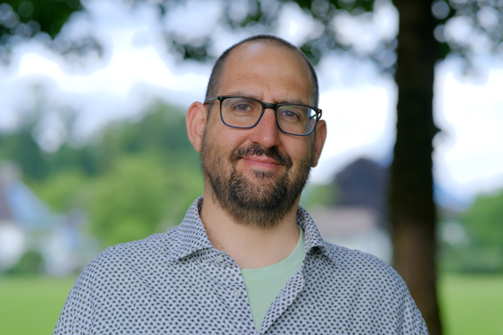

## Hi there 👋 

I am Carlos, aka genkidama37. I am on a journey exploring trails of life-long learning. I would describe myself as a curious enthusiast. I like to try new things. Experiment, break things, learn from it.

I am a software developer. At the moment I'm looking for a new job (aka new challenges).

I am quite good at SQL due to a position as Data Management Technician and recently worked as Full Stack Developer with focus on 

 

Check on my [LinkedIn](https://www.linkedin.com/in/juan-carlos-sanchez-recio-24b359241/) profile to get more detail.

I find that the world of IT technology is so awesome!! There is plenty to experiment and learn. Sometimes is like a black hole🌀 where you get and is not always to come out.

When I am not tackling IT stuff I am spending time with friends(ocasionally playing chess♟️), cooking delightful meals 🧆 or boxing 🥊 to get fit and let off steam. Not to mention that I like to sing whenever I feel like and enjoy going to karaoke🎤.

I get said that I am kind of nerdy. Which totally I agree. I am a huge fan of Dragon Ball anime and One Piece both manga and anime. You can tell that just checking my desktop backgrounds 😂.

I had the honor of being the main character on [this video](https://www.youtube.com/watch?v=FIES2k-RGIM)

This [performance](https://x.com/RoronoaCharles/status/1948584386250899687) is as well something I am very proud of.

I recently attended an online course about [Clean Architecture](https://xurxodev.com/curso-refactoring-clean-architecture-react/) from [xurxodev](https://github.com/xurxodev) and really loved it.
Now I am willing to apply the learnings on some pet project.

I also spend time in my free time doing this course: [Testing Sostenible con TypeScript](https://testingsostenible.com/).

And have started reading [Test Driven Development: By Example](https://www.amazon.com/Test-Driven-Development-Kent-Beck/dp/0321146530) and practicing my own [TDD Katas](https://github.com/genkidama37/tdd-katas). 

I started 2 months ago learning  and I don't regret it.

After being skeptical for a while, I’ve started using  and playing Vibe Coding, and I’m really enjoying it.
